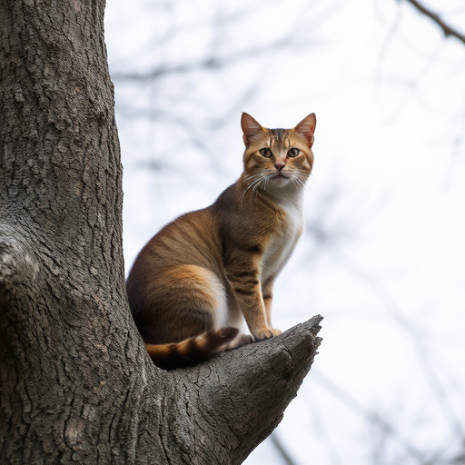
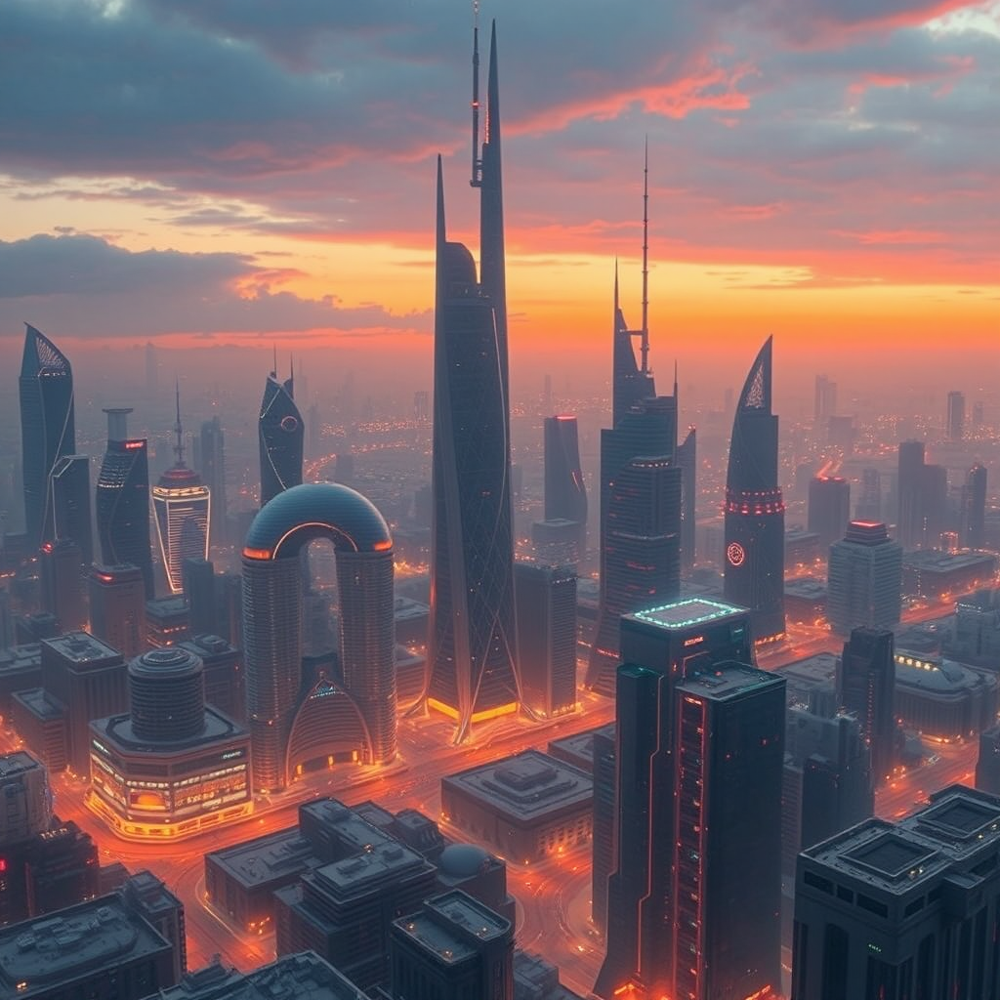
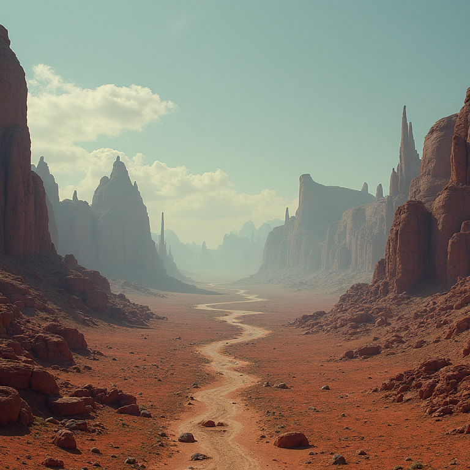
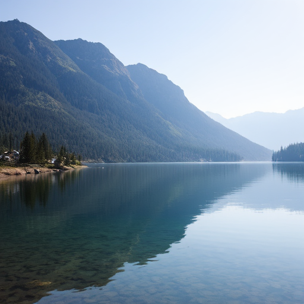
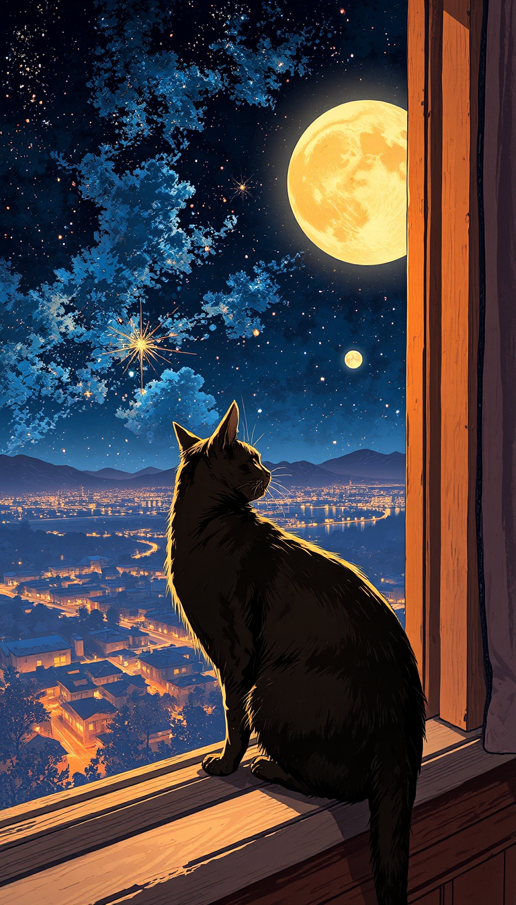

# flux.swift.cli

# FLUX.1 Image Generation Tool

## Overview

`flux.swift.cli` is a command-line interface (CLI) tool for generating images based on text prompts using the FLUX.1 model.

## Features

- **Text-to-image generation**: Generate images from text prompts.
- **Image-to-image generation**: Generate images using both text prompts and reference images.
- **Customizable parameters**: Control image size, inference steps, guidance scale, and more.
- **Model optimization**: Options for quantization and float16 precision.
- **Multiple model support**: Choose between FLUX.1 Schnell and FLUX.1 Dev models.

## Installation

### Download Pre-built Binary

Download the latest release from the [Releases](https://github.com/mzbac/flux.swift.cli/releases) page as a `.zip` file and extract it to your desired location.

### Build from Source

If you prefer to build the project from source, follow these steps:

1. Clone the repository:
   ```bash
   git clone https://github.com/mzbac/flux.swift.cli.git
   cd flux.swift.cli
   ```

2. Build the project using `xcodebuild`:
   ```bash
   xcodebuild build -scheme flux.swift.cli -destination 'platform=macOS' -derivedDataPath ./dist
   ```

3. The built binary will be located in the `dist` directory. You can run it directly or move it to a location in your PATH:
   ```bash
   ./dist/Build/Products/Debug/flux.swift.cli
   ```

## Usage

Once extracted, run `flux.swift.cli` via the command line:

```bash
./flux --prompt "A cat is sitting on a tree" --width 512 --height 512 --steps 4 --guidance 3.5 --output output_image.png --quantize
```


## Options

```bash
--prompt <prompt>       # The text prompt to generate an image from (default: "A cat is sitting on a tree")
--width <width>         # Image width (default: 512)
--height <height>       # Image height (default: 512)
--steps <steps>         # Number of inference steps (default: 4)
--guidance <scale>      # Guidance scale (default: 3.5)
--output <path>         # Output image path (default: "output_image.png")
--repo <repository>     # FLUX model repository (default: "black-forest-labs/FLUX.1-schnell")
--seed <seed>           # Random seed for generation (default: 2)
--quantize              # Enable model quantization
--float16               # Enable float16 precision (default: true)
--model <type>          # FLUX model type: "schnell" or "dev" (default: "schnell")
--hf-token <token>      # Hugging Face API token (required for dev model)
--lora-path <path>      # Path to the LORA adapter file
--init-image-path <path>      # Path to the reference image for image-to-image generation
--init-image-strength <float> # Strength of the initial image influence (0-1, default: 0.3)
```

## Model Types

- **FLUX.1 Schnell**: The default model, optimized for faster inference.
- **FLUX.1 Dev**: A non commercial model that requires a Hugging Face API token.

### Using FLUX.1 Dev Model

To use the FLUX.1 Dev model, you need a Hugging Face API token with "Read access to contents of all public gated repos you can access" permission. Use the `--model dev` and `--hf-token` options:

```bash
./flux --model dev --hf-token YOUR_HF_TOKEN --prompt "Your prompt here"
```

## LORA Adapter

FLUX.swift.cli now supports LORA (Low-Rank Adaptation) adapters for fine-tuned image generation. To use a LORA adapter:

1. Find a compatible LORA adapter file (.safetensors format)
2. Use the `--lora-path` option to specify the path to the LORA adapter file or the id of the adapter on Hugging Face

Example:

```bash
./flux --prompt "A portrait in the style of Van Gogh" --lora-path /path/to/vangogh_lora.safetensors --output vangogh_portrait.png
```

Note: Ensure that the LORA adapter is compatible with the FLUX model you're using.

## Examples

1. Generate an image using the default FLUX.1 Schnell model:

```bash
./flux \
  --prompt "A futuristic cityscape" \
  --width 1024 \
  --height 1024 \
  --steps 10 \
  --guidance 5.0 \
  --output futuristic_city.png \
  --quantize
```


2. Generate an image using the FLUX.1 Dev model:

```bash
./flux \
  --model dev \
  --hf-token YOUR_HF_TOKEN \
  --prompt "An alien landscape" \
  --width 768 \
  --height 768 \
  --steps 20 \
  --guidance 5.0 \
  --output alien_landscape.png \
  --quantize
```


3. Quick try with minimal parameters:

```bash
./flux \
  --prompt "A serene mountain lake" \
  --quantize
```


4. Generate an image using a LORA adapter:

```bash
./flux \
  --prompt "GHIBSKY style, a cat on a windowsill gazing out at a starry night sky and distant city lights" \
  -q \
  --guidance 7.5 \
  --lora-path aleksa-codes/flux-ghibsky-illustration \
  --output ghibsky_cat.png \
  --seed 2 \
  --width 768 \
  --height 1344
```



5. Generate an image using a reference image:

```bash
./flux \
  --model dev \
  --prompt "Watercolor sketch of a tranquil mountain lake: a soft sun, pastel sky, subtle green pines, and delicate lines for distant snowy peaks." \
  --init-image-path reference.png \
  --init-image-strength 0.16 \
  --steps 20 \
  --seed 43 \
  --guidance 3.5 \
  --height 512 \
  --width 512 
```

